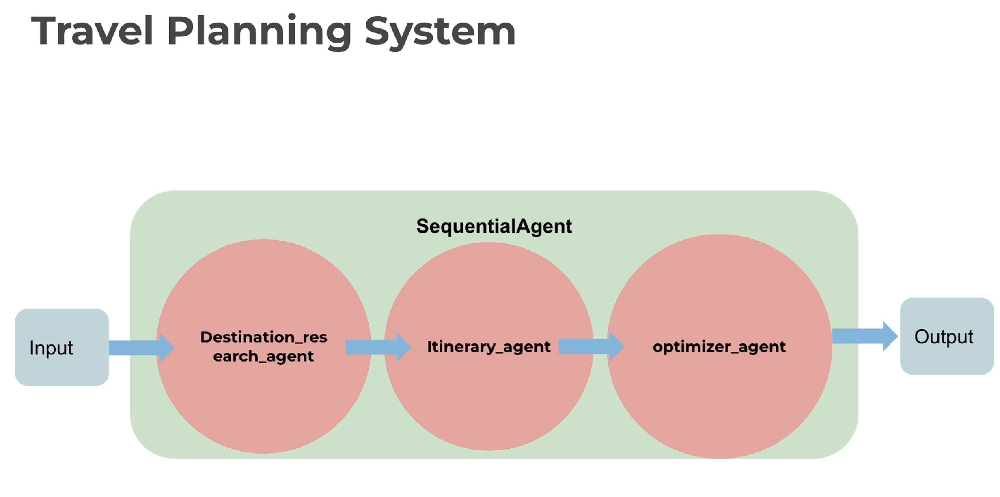
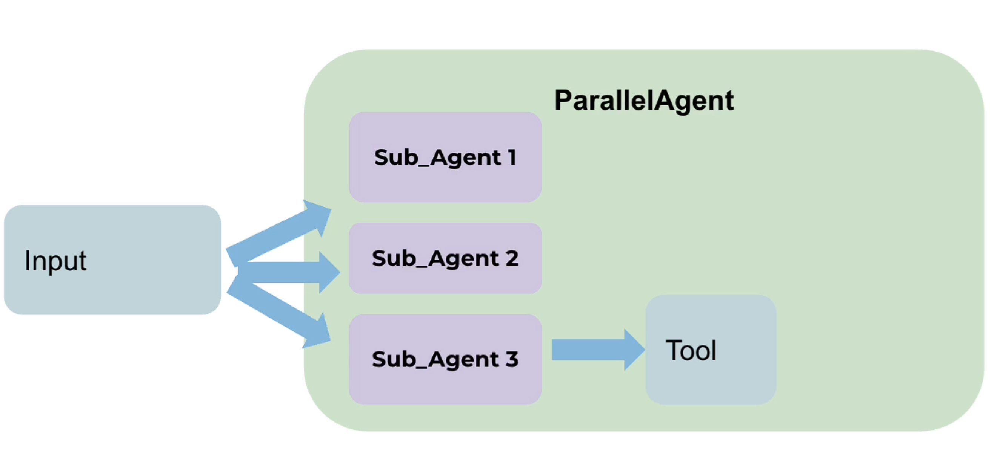
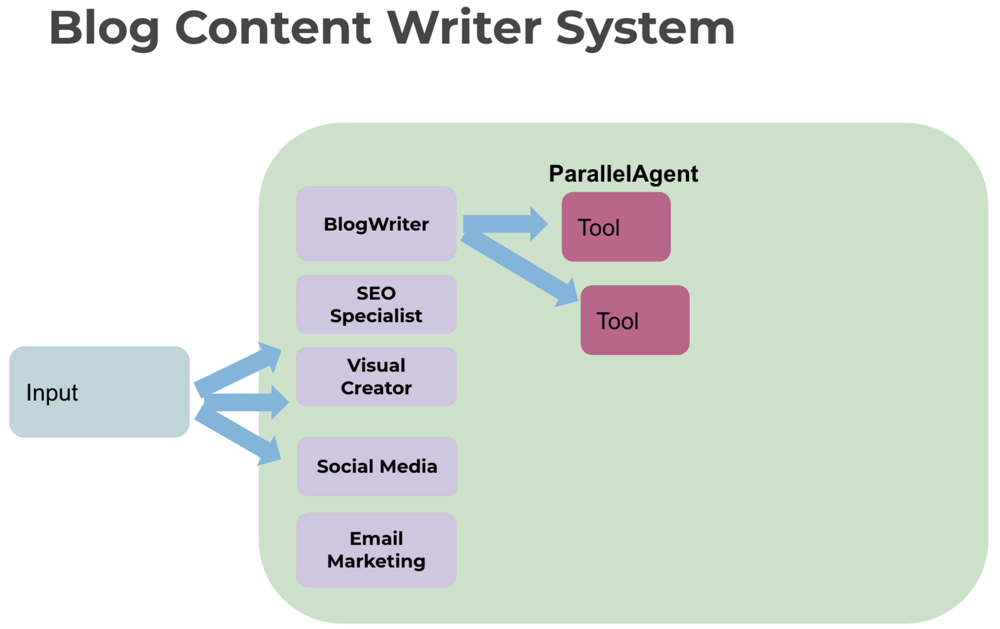
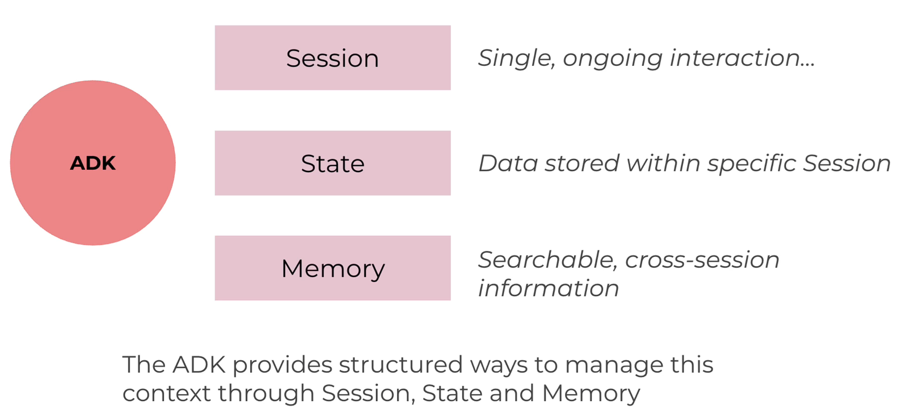
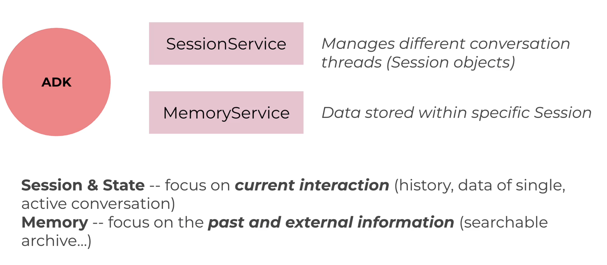
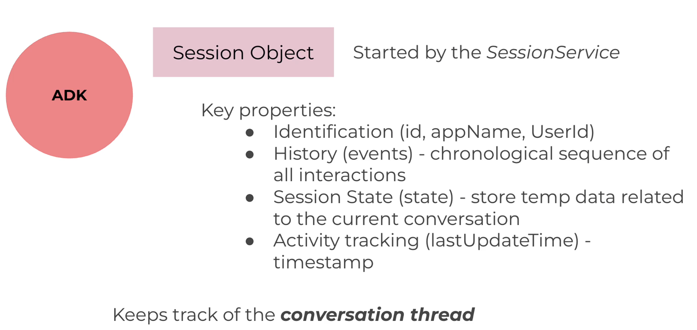
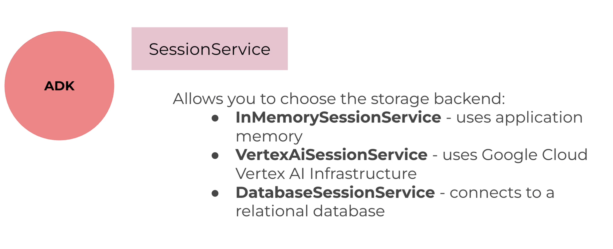
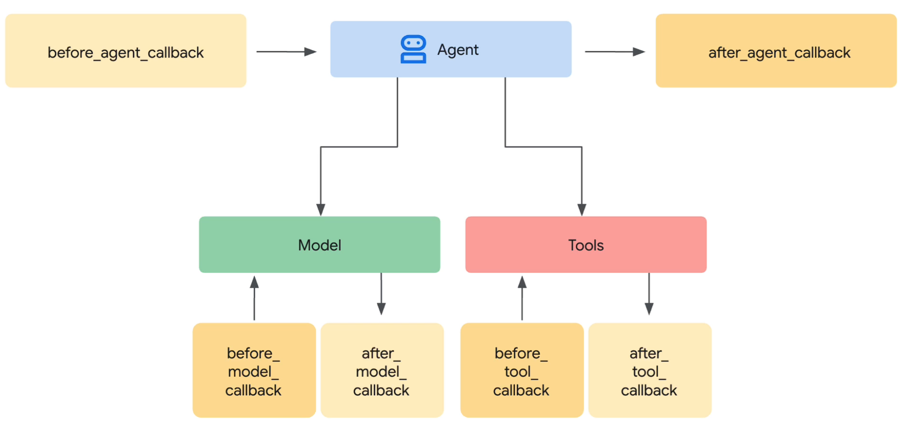

# Google Agent Development Kit (ADK)

ADK is a modular, open-source framework for building and deploying production-ready AI agents, with deep integration across the Gemini and Google Cloud ecosystem.

https://google.github.io/adk-docs/

## [Using Different Models with ADK](https://google.github.io/adk-docs/agents/models/)
)
ADK allows to integrate various Large Language Models (LLMs) into our agents.

## [Agent types & models](https://medium.com/@danushidk507/google-agent-development-kit-adk-agent-types-and-models-9c2189d5a7d2)
ADK provides several distinct agent categories to build sophisticated applications.
1. **LLM Agents** - Direct language model interaction classes (`LlmAgent`, `Agent`)
2. **Workflow Agents** - Multi-step execution patterns (SequentialAgent, ParallelAgent, LoopAgent)
3. **Custom Agents** - User-defined agent implementations

## [Workflow Agents](https://google.github.io/adk-docs/agents/workflow-agents/)

- Components for orchestrating the execution flow of sub-agents.
- Workflow Agents operate based on predefined logic.
  They determine the execution sequence according to their type (e.g., sequential, parallel, loop) without consulting an LLM for the orchestration itself. This results in deterministic and predictable execution patterns.

### [Sequential Agents](https://google.github.io/adk-docs/agents/workflow-agents/sequential-agents/)

A SequentialAgent runs its sub-agents one after another in the exact order they appear, completing each step before starting the next.
- This pattern is ideal for multi-step workflows or pipelines where later steps depend on earlier outputs.
- It provides deterministic execution ordering and can be combined with error handling, conditional checks, or retries to control flow between steps.

### [Parallel Agents](https://google.github.io/adk-docs/agents/workflow-agents/parallel-agents/)

 - Workflow agent that executes its sub-agents concurrently.
 - This dramatically speeds up workflows where tasks can be performed independently.

## [Session & Memory](https://google.github.io/adk-docs/sessions/)
Agents in a multi-turn conversation needcontext and the ability to understand it. 
ADK provides structured ways to manage this context through `Session`, `State`, and `Memory`.

1. `Session`: The Current Conversation Thread.
   - Represents a single, ongoing interaction between a user and your agent system.
   - Contains the chronological sequence of messages and actions taken by the agent (referred to
     `Events`) during that specific interaction.
   - A Session can also hold temporary data (`State`) relevant only during this conversation.

2. `State` (`session.state`): Data Within the Current Conversation.
   - Data stored within a specific Session.
   - Used to manage information relevant only to the current, active conversation thread (e.g., items
     in a shopping cart during this chat, user preferences mentioned in this session).

3. `Memory`: Searchable, Cross-Session Information.
   - Represents a store of information that might span multiple past sessions or include external
     data sources.
   - It acts as a knowledge base the agent can search to recall information or context beyond the
     immediate conversation.

ADK provides services to manage these concepts:
1. `SessionService`: Manages the different conversation threads (`Session` objects).
   - Handles the lifecycle: creating, retrieving, updating (appending `Event`s, modifying `State`), and deleting individual Sessions.

2. `MemoryService`: Manages the Long-Term Knowledge Store (`Memory`).
   - Handles ingesting information (often from completed `Session`s) into the long-term store.
   - Provides methods to search this stored knowledge based on queries.

### [The `Session` Object](https://google.github.io/adk-docs/sessions/session/)
- When a user starts interacting with your agent, the `SessionService` creates a `Session` object (`google.adk.sessions.Session`).
- This object acts as the container holding everything related to that **one** specific chat thread.

### [`SessionService` Implementations](https://google.github.io/adk-docs/sessions/session/#sessionservice-implementations)
ADK provides different `SessionService` implementations:
1. `InMemorySessionService` - stores all session data directly in the application's memory.
2. `VertexAiSessionService` - uses Google Cloud Vertex AI infrastructure via API calls for session management.
3. `DatabaseSessionService` - connects to a relational database (e.g., PostgreSQL, MySQL, SQLite) to store session data persistently in tables.

## [Callbacks - Filtering and Guardrails](https://google.github.io/adk-docs/callbacks/)

**Callbacks** let you hook into an agent's execution at key stages to observe, customize, or control behavior without modifying ADK's core code.  
Simply define functions and attach them to your agent - ADK calls them automatically at predefined checkpoints.

