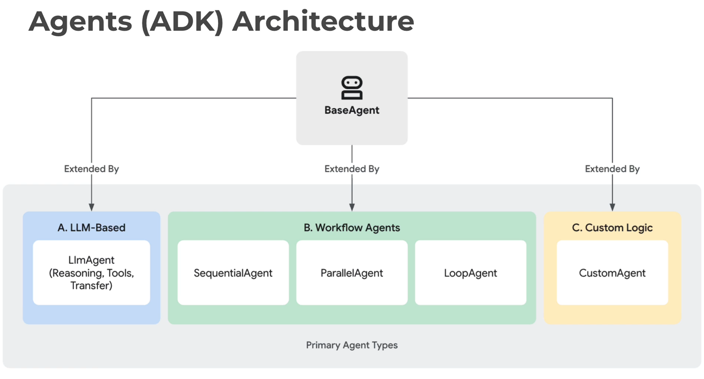
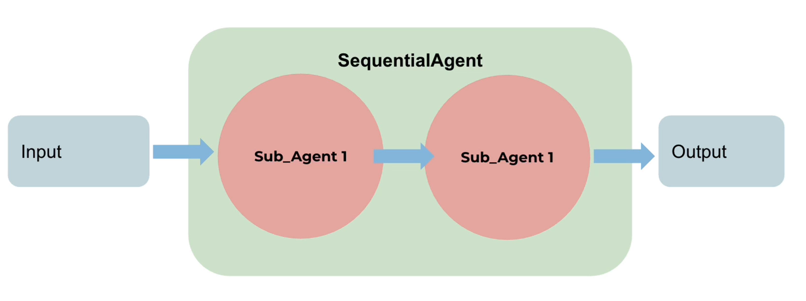

# Google Agent Development Kit (ADK)

ADK is a modular, open-source framework for building and deploying production-ready AI agents, with deep integration across the Gemini and Google Cloud ecosystem.

https://google.github.io/adk-docs/

## [Using Different Models with ADK](https://google.github.io/adk-docs/agents/models/)
)
ADK allows to integrate various Large Language Models (LLMs) into our agents.

## [Agent types & models](https://medium.com/@danushidk507/google-agent-development-kit-adk-agent-types-and-models-9c2189d5a7d2)
ADK provides several distinct agent categories to build sophisticated applications.
1. LLM Agents - Direct language model interaction classes (`LlmAgent`, `Agent`)
2. Workflow Agents - Multi-step execution patterns (SequentialAgent, ParallelAgent, LoopAgent)
3. Custom Agents - User-defined agent implementations

## [Sequential Agents](https://google.github.io/adk-docs/agents/workflow-agents/sequential-agents/)

A SequentialAgent runs its sub-agents one after another in the exact order they appear, completing each step before starting the next.
- This pattern is ideal for multi-step workflows or pipelines where later steps depend on earlier outputs.
- It provides deterministic execution ordering and can be combined with error handling, conditional checks, or retries to control flow between steps.

